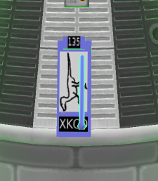

How hard can rocket modding be?!?
=================================

When you are navigating to a "below X meters" destination by flying horizontally,
it's easy enough to aim yourself, but much harder to estimate the time to your
target. This mod attempts to calculate this, with certain caveats:

* The celestial body is assumed to be spherical
* You are assumed to be traversing across the surface at your exact surface velocity
* You are assumed to be moving directly towards the destination unerringly
* Your velocity is assumed to be constant

Within those assumptions, this will provide time-to-destination every second.

Internal notes
--------------

https://wiki.kerbalspaceprogram.com/wiki/API:Vessel

Great example: https://github.com/taraniselsu/TacExamples/blob/main/01-SimplePartlessPlugin/Source/SimplePartlessPlugin.cs

$ tail -F ~/.config/unity3d/Squad/Kerbal\ Space\ Program/Player.log | grep ArmstrongNav

$ tail -F ~/.config/unity3d/Squad/Kerbal\ Space\ Program/Player.log | grep '\[ArmstrongNav\]'

TODO: Whenever a maneuver node is created or moved, cite its altitude. Will allow height prediction
by just clicking on the path somewhere.

Velocimeter
-----------

A measurement tool designed to give the pilot several forms of assistance.

* Guide your descent in the last phases. As you approach the terrain, just keep
  the "Time to Arrival" and "Approach Speed" similar, and you'll gently land.
* Calculate phase angle change per orbit
* Automatic circularization of orbit or plane matching (by creating maneuver nodes)
* Burn for a maneuver node at the perfect time, putting half the dV before and half
  after the node time.
* For no particular reason, this also allows mission-based numbering of vessels. A
  ship design is a mission family, so the first mission of the "For River" design
  is the "For River 1", followed by the "For River 2", etc.

TODO: Calculate horizontal velocity (ground speed)

Depiction of velociraptor is taken from XKCD 135, made available under the terms of CC-BY-NC,
original image found here: https://xkcd.com/135/

Auto-rename vessels
- Save a "mission count" with every ship design
- On launch, rename "For River" (design name) to "For River I" (mission name)
- Keep this in save file. If you revert to VAB, it should un-count the mission.
- Govern with build-time flag on the Velocimeter, because convenience
